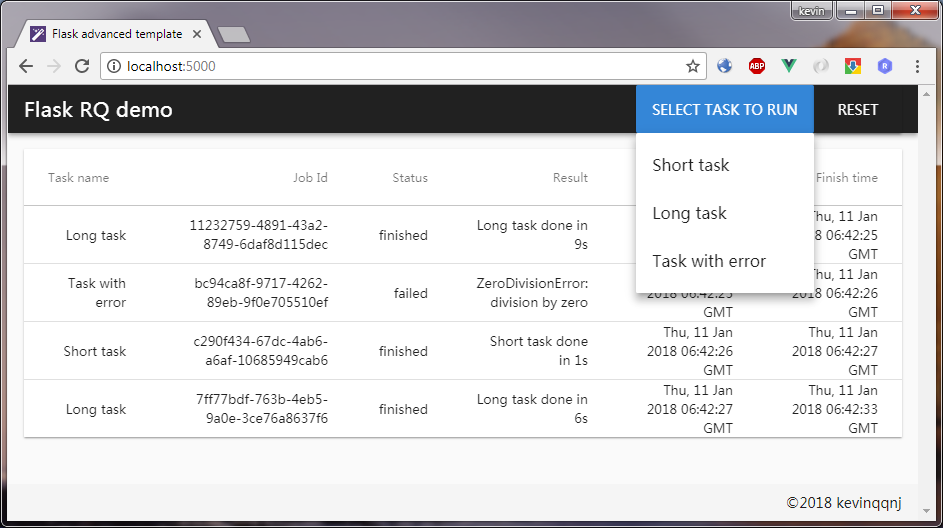

# Flask app template - RQ

> a simple Flask app template for task queue.

> working with python3. 

> Thanks to: Benjamin Bertrand https://beenje.github.io/blog/posts/running-background-tasks-with-flask-and-rq/



It's based on a simple Flask template, check here: https://github.com/kevinqqnj/flask-template-simple

## Features:
- Simple but full struct of Flask template to support RQ
- integrated with RQ, redis
- use Vue.js as frontend (you can replace as whatever frontend you like)
- frontend shows dashboard of queued tasks

## Prerequisite
You should have Redis installed.
> Ubuntu:
```
sudo wget http://download.redis.io/redis-stable.tar.gz
sudo tar xzf redis-stable.tar.gz
cd redis-stable
sudo make
sudo make install
```

> Windows:
using Cygwin: https://www.jianshu.com/p/28960f5b1464

## Install

``` bash
# git clone
# create virtual env
python3 -m venv venv
source venv/bin/activate
# install python modules
pip3 install -r requirements.txt
```

Set redis server address in `/config.py`, default is:
`REDISTOGO_URL = os.getenv('REDIS_URL', 'redis://localhost:6379')`


## Start up
```
# start Redis server
redis-server &
# run rq worker
python manage.py runworker
# run http server in anther terminal
python manage.py runserver
```
Bingo! Check app in your web browser at: http://localhost:5000

## deploy to Heroku Server
ready for deploy to [Heroku](https://www.heroku.com)
`Procfile`, `heroku.sh` and `runtime.txt` are included. It will use one dyno to run both worker and http server.
```
create app in heroku
git push to heroku
configure env. variables
```
refer to: https://devcenter.heroku.com/articles/getting-started-with-python

## Expansion
For production app, you can easily expand functions as you wish, such as:
- Flask_Compress
- Flask_Cache
- Flask_Admin
- Flask_Security
- [flask-template-advanced](https://github.com/kevinqqnj/flask-template-advanced)

> For a detailed explanation on how things work, check out the [guide (CHN)](https://www.jianshu.com/p/f37871e31231).
